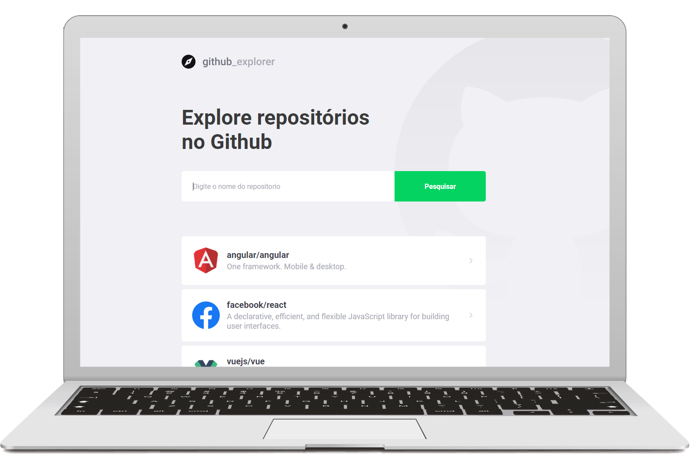

<h1 align="center">
 GitHub Explorer
</h1>

<h3 align="center">
 Explore repositórios de forma simples!
</h3>

<p align="center">
  <a href="#rocket-sobre-o-projeto">Sobre o projeto</a> | <a href="#computer-tecnologias">Tecnologias</a> | <a href="#books-guia-de-instalação-e-execução">Guia de instalação e execução</a> | <a href="#scroll-licença">Licença</a>
</p>

## Layout


## :rocket: Sobre o projeto

<p>Este é um projeto para explorar repositórios no GitHub de maneira fácil e simples.</p>
<p>Adicione quantos quiser e tenha fácil acesso as principais informações e issues abertas.</p>

## :computer: Tecnologias

- ReactJS
- Typescript
- ESLint
- Prettier
- React Router DOM
- React Navigation
- Styled Components
- Axios

## :books: Guia de instalação e execução

### Pré-requisitos

- Yarn ou npm
- PostgreSQL

### Como executar

```bash
# Clone este repositório e acesse a pasta
git clone https://github.com/nathaliacristina20/gostack-github-explorer.git && cd gostack-github-explorer

# Instale as dependencias com yarn OU
yarn

# Instale as dependencias com npm
npm install

# Rode a aplicação com o comando de acordo com seu gerenciador de pacotes
yarn start

# OU
npm start

# Pronto, a aplicação está rodando! Acesse http://localhost:3000 no browser.
```

## :scroll: Licença

Esse projeto está sob a licença MIT. Veja o arquivo <a href="https://github.com/nathaliacristina20/gostack-github-explorer/blob/master/LICENSE">LICENSE</a> para mais detalhes.

<hr />
<p>by Nathalia Cristina :wave: <a href="https://linktr.ee/nathaliacristina20">Get in touch!</a></p>
